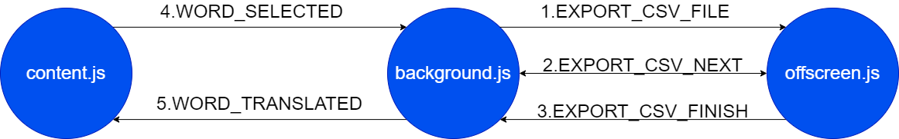

# Local Translation

Translate English to Chinese.

## Mechanism

1. Insert english-to-chinese dictionary data into **local** `IndexDB` database Google self-installed after extension installed.

2. Monitor and get the user's selection text we called `selText`;

3. Match `selText` against with translation result in **local** database.

4. Messaging in `background.js`, `content.js`, `offscreen.js`

## Usage

Download the zip file and then import to your chrome browser.

~~Select features you wanna display on the popup window.~~

## TODO

- [x] Popup page.
- [ ] Context menu.
- [x] Selection translate.
- [ ] Sync dictionary manually.
- [ ] User custom display information.
  - Phonetic;
  - Definition-English;
  - Collins;
  - Oxford;
  - Tag;
  - Bnc;
  - Frequency;
  - Exchange;
  - Detail;
  - Audio
- [ ] Register new words;
